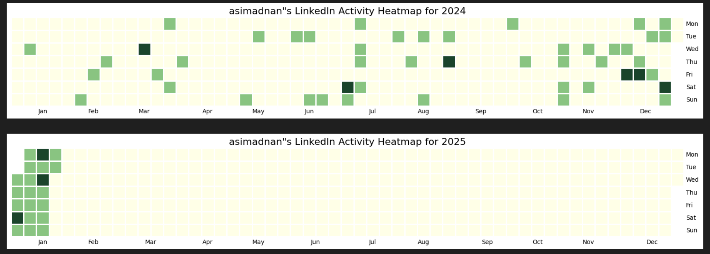
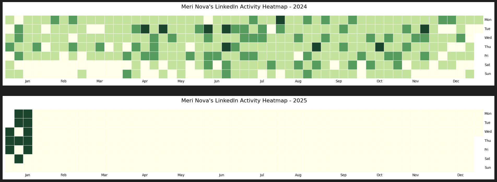

# LinkedIn Activity Heatmap Visualizer




A simple tool to create GitHub-style activity calendars from LinkedIn post history.

## Getting Your Data

### Available Methods
1. **Official LinkedIn API** (Recommended)  
   - Requires developer access
   - Complex Auth stuff
   
2. **Web Scraping**  
   - High risk of account restriction
   - Technically complex to implement

3. **Kleo Extension Workaround**  
   - Method used in this project
   - Browser extension that surfaces post data
   - Detailed guide: [**Get LinkedIn Posts Guide** (get-linkedin-posts.md)

4. **Manual Export**  
   - Export your data via LinkedIn's "Download Your Data" feature
   - Limited to your own profile

## ⚠️ Important Disclaimer
**Use the Kleo method at your own risk:**  
- This approach may violate Kleo's terms of service
- No guarantee of data accuracy/completeness
- Your LinkedIn account security is your responsibility

```plaintext
Alternative safe methods recommended:
1. Use LinkedIn's official data export
2. Work with approved API partners
```

## Requirements
```bash
Python 3.8+ with:
- pandas
- plotly
- jupyter
- calmap
```
## Quick Start

Get your data using the guide

Save data as posts.json in project data folder

Run Jupyter notebook

## Features
- Hover-to-see-date functionality

- Customizable date ranges

- Multiple color schemes


## Ethical Note
This tool is intended for:

- Personal education

- Data visualization practice

- Understanding activity patterns

Not recommended for commercial use or bulk data collection.
