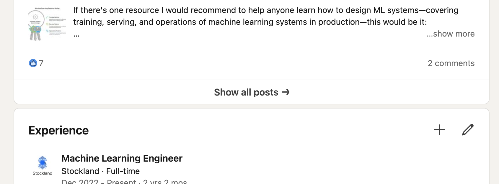
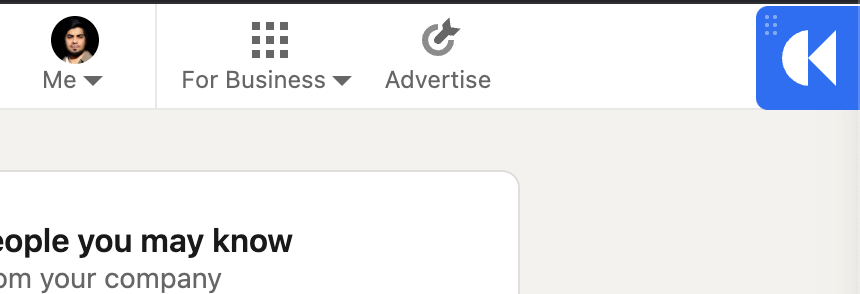
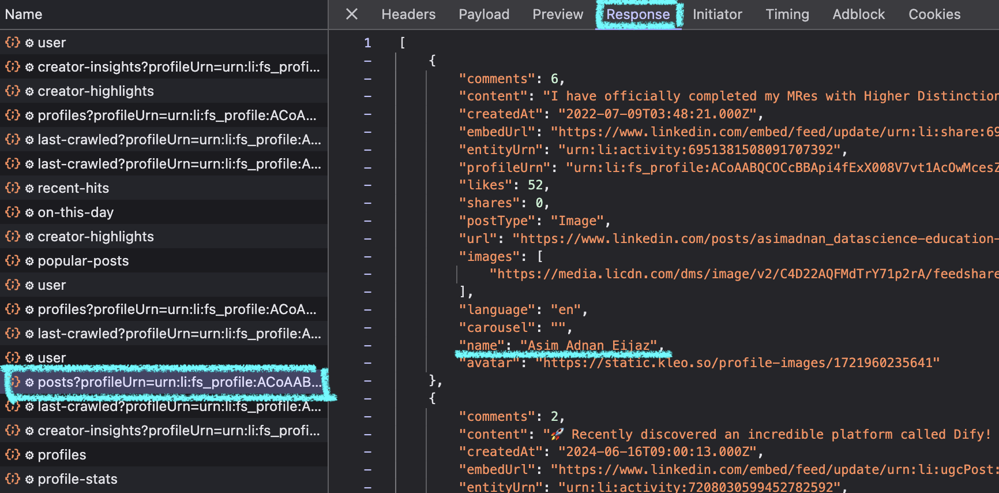

# LinkedIn Post Data Extraction Guide

## Preparation
1. **Install Kleo Extension**  
   Download and install the [Kleo browser extension](https://kleo.so/) for Chrome

2. **Access LinkedIn Profile**  
   - Log into your LinkedIn account
   - Navigate to your profile page
   - Click **"Show all posts"** under the Activities section

   

## Data Collection Process

3. **Activate Kleo Interface**  
   - Look for the Kleo icon (▶) in your browser's toolbar  
   - Click to open the Kleo analysis sidebar

   

4. **Refresh Post Data**  
   - In the Kleo sidebar:  
     - Check the "Last updated" timestamp  
     - If data is outdated/missing:  
       1. Click **Refresh**  
       2. Wait 2-5 minutes for data processing

   

## Data Extraction Steps

5. **Access Developer Tools**  
   - Type `chrome://extensions/` in your address bar  
   - Find Kleo in your installed extensions  
   - Click **"Service worker"**

   

6. **Prepare Network Monitoring**  
   - In DevTools:  
     1. Go to **Network** tab  
     2. Click **Clear** (⎘) to reset monitoring  
     3. Check **"Preserve log"** option

   

7. **Capture API Request**  
   - Return to LinkedIn profile tab  
   - Refresh the page (F5/Cmd+R)  
   - Reopen Kleo sidebar  
   - Wait for full data load

8. **Identify Critical Request**  
   - In DevTools Network tab:  
     1. Search: `posts?profileUrn=urn:li:fs_profile`  
     2. Select the matching request  
     3. Switch to **Response** tab

   

## Data Export

9. **Save Post Data**  
   - Right-click response content  
   - Choose **Copy**  
   - Paste into new text file  
   - Save as `posts.json`

```json
// Example valid structure
{
  "data": [
    {
      "createdAt": "2023-01-15T08:00:00Z",
      "content": "Example post text...",
      "metrics": {...}
    }
  ]
}
```

## Next Steps
Proceed to the [heatmap visualization notebook](heatmap.ipynb) to generate your activity calendar.


## Important Notes
- **Data Accuracy**: Kleo's results may not reflect 100% of your posts
- **Account Safety**: Maintain normal browsing patterns during data capture
- **Compliance**: This method should only be used on your own profile