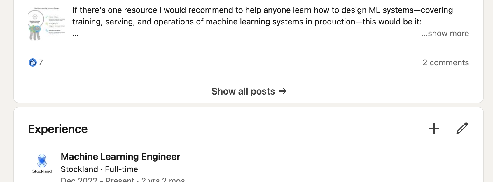
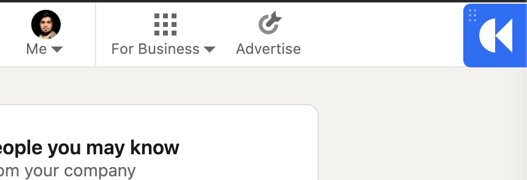
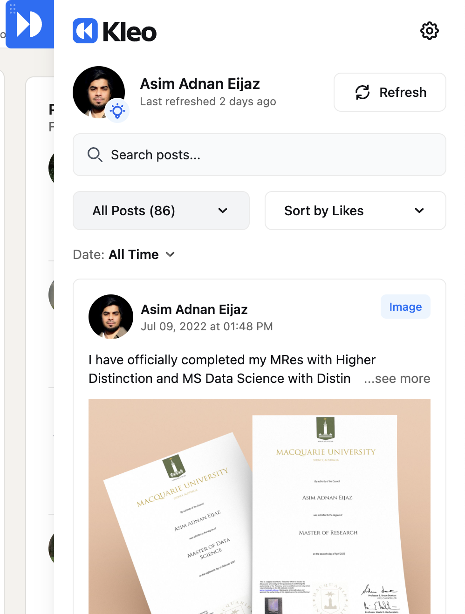
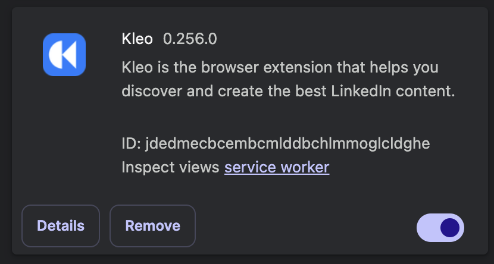
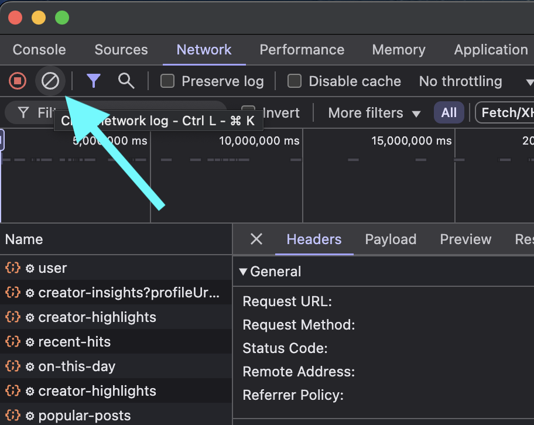
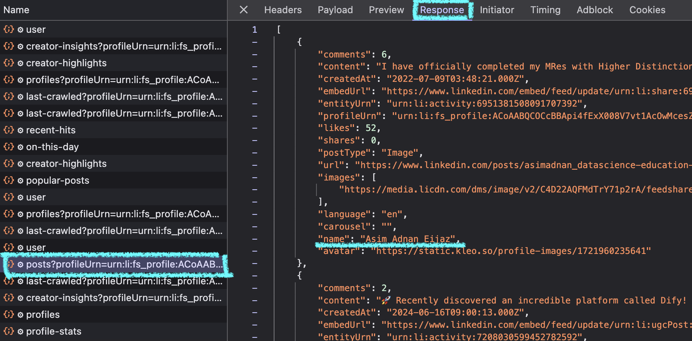

# How to get all of your linkedin posts as JSON

1- Install [Kleo](https://kleo.so/)
2- Go to your linkedin profile
3- Click **Show all posts**

4- If you have Kleo installed and logged in, you will see this kleo icon on top right corner of your linkedin profile.

5- Once you click it, it will open your kleo sidebar like this, if it shows no posts or the refresh date is quite old, just hit refresh and wait a few minutes for kleo to scrape your data.

6- Now go to manage extension page in your browser, for chrome its `chrome://extensions/` naviagte and find Kleo.

7- click on **service worker**

8- it will open up chrome dev tools specifc this extension, click this button to clear all requests.

9- Now go back to your linkedin profile, refresh the page and open up the kleao sidebar again and make sure all of your posts are visible.

10-  then go back to the chrome dev tools and look for this specifc network request

`posts?profileUrn=urn:li:fs_profile:.... `

once you select this request, make sure you are on response tab on the right side.

The content in response tab is all your posts in a JSON fromat.

Copy all of it and save it as JSON file.

11- Tada you now have all of your posts in a JSON format, now follow the heatmap.ipynb notebook to create your own activity heatmap.

